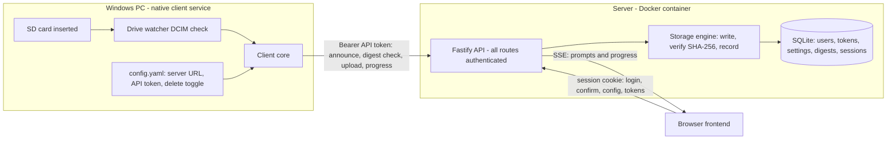

# FrameKeeper — Architecture & Design

Steering document for contributors (human or agent). It reflects the code as implemented; if you
change behavior described here, update this file in the same change. Known gaps and future work
live in [TODO.md](TODO.md).

## System overview

FrameKeeper backs up camera SD cards to a central server. It is **always client-server**:

- The **server** never touches SD cards. It receives uploads, verifies them, stores them, and
  serves the web frontend. It is designed to run in Docker (e.g. on a NAS).
- The **client** never stores backups. It runs natively on Windows (as a service), detects card
  insertions, hashes files, uploads them, and optionally deletes card files after the server has
  confirmed a verified copy.
- The **frontend** is a Preact SPA built to static files and served by the server. It is the only
  management surface: confirmation prompts, live progress, history, server settings, API tokens.



## Repository layout

npm workspaces monorepo. TypeScript everywhere, CommonJS output for Node packages.

| Path | Role |
| --- | --- |
| `packages/shared/src/index.ts` | API types (`AnnounceRequest`, `BackupSession`, ...), `sha256File`, `matchesAnyPattern` |
| `packages/server/src/index.ts` | Composition root: env, DB, auth, routes, static frontend |
| `packages/server/src/env.ts` | Environment variables (`PORT`, `FK_DATA_DIR`, `FK_BACKUP_DIR`, `FK_FRONTEND_DIR`) |
| `packages/server/src/db.ts` | Schema creation (`node:sqlite`, WAL). No migration framework: additive `CREATE TABLE IF NOT EXISTS` |
| `packages/server/src/crypto.ts` | scrypt password hashing, salted-SHA-256 token hashing, random ids/secrets |
| `packages/server/src/repositories.ts` | All SQL, mapping rows to camelCase shared types |
| `packages/server/src/auth.ts` | Global `onRequest` auth hook + `/api/auth/*` routes + admin seeding |
| `packages/server/src/routes.ts` | Everything else under `/api/*` |
| `packages/server/src/storage.ts` | `StorageEngine`: temp write, digest verify, dated layout, record |
| `packages/server/src/events.ts` | `EventBus`: SSE broadcaster for the frontend |
| `packages/client/src/index.ts` | Poll loop; spawns one backup run per detected card |
| `packages/client/src/drives.ts` | Card detection: `drivelist` (Win32 device APIs) on win32, `FK_WATCH_DIRS` elsewhere |
| `packages/client/src/backup.ts` | Per-card workflow: announce, wait, hash, dedupe, upload, delete |
| `packages/client/src/api.ts` | HTTP wrapper adding the bearer token; streaming upload |
| `packages/client/src/config.ts` | `config.yaml` loading/validation |
| `packages/client/src/service/` | `node-windows` install/uninstall scripts (plain JS, copied via `allowJs`) |
| `packages/frontend/src/` | Preact SPA (`App.tsx`, `views/`, `api.ts`) |
| `scripts/smoke-test.mjs` | End-to-end test using a fake card directory |
| `Dockerfile`, `docker-compose.yml` | Server container |
| `docs/USAGE.md` | Operator guide (workflow, backup process, deployment models); bundled into the frontend Guide page at build time |
| `.github/workflows/ci.yml` | CI: build, unit tests, smoke test |

## Core invariants — do not break these

1. **Verify before acknowledge.** The server must never record or acknowledge an upload until it
   has re-read the bytes from its own disk and matched the client-declared SHA-256
   (`StorageEngine.storeUpload`). A mismatch deletes the temp file and returns HTTP 422.
2. **Acknowledge before delete, and deletion is opt-in.** The client must never delete a card
   file unless (a) the server confirmed a verified copy (or the digest already existed) and
   (b) `deleteAfterBackup: true` in the client's `config.yaml`. Default is `false`.
3. **No unauthenticated endpoints.** Every `/api/*` route requires a session cookie or bearer
   token, enforced by the single hook in `auth.ts`. The only exception is `POST /api/auth/login`
   (bootstrap). Static assets are public; the SPA redirects to login. If you add a route under a
   different prefix than `/api/`, you must extend the hook.
4. **Secrets are never stored or logged in clear.** Passwords: scrypt with per-record salt
   (`scrypt$N$r$p$salt$hash`). Web session secrets and API token secrets: salted SHA-256 (they
   are 256-bit random values, so a slow KDF is unnecessary). All comparisons are constant-time.
   API tokens are shown exactly once, at creation.
5. **Forced first-login password change.** The DB is seeded with `admin`/`admin` and
   `must_change_password = 1`; while set, only `/api/auth/change-password`, `/logout`, `/me` are
   allowed (403 `password_change_required` otherwise).
6. **Digests are global dedupe keys.** `files.sha256` is unique; the same content is stored once
   regardless of card or client.
7. **Separation of duties.** Detection and card I/O live only in the client; storage and
   record-keeping live only in the server. Don't add card access to the server or storage to the
   client.

## Authentication model

- **Browser**: `POST /api/auth/login` issues an `HttpOnly` cookie `fk_session=<id>.<secret>`;
  the secret's salted hash is stored in `web_sessions` with a 7-day expiry.
- **Client machines**: bearer token `fk_<tokenId>_<secret>` created in the frontend
  (Settings -> API tokens). The server looks up by `tokenId`, verifies the secret hash, updates
  `last_used_at`. Tokens are revocable (`revoked_at`).
- **Route classes**: management and read routes (config, tokens, session confirm/dismiss,
  file index, session history, live status, SSE) require a *user* session — bearer tokens get
  403 (`requireUser` in `routes.ts`). Client routes (announce, digests, upload, progress,
  complete, single-session poll) accept either credential.

## Backup workflow

1. Client polls removable volumes (default every 3 s) via `drivelist`, which calls the Windows
   device APIs directly (no shelling out). A removable, non-system volume with a `DCIM/`
   directory is a camera card. Re-insertion after removal triggers a new detection.
2. Client scans `DCIM/`, filters its local `ignorePatterns`, and `POST /api/cards/announce`
   with the file list. The server filters its own ignore patterns, creates a `sessions` row
   (`pending`, or `confirmed` if `autoConfirm` is on) and broadcasts it over SSE.
3. The frontend shows the prompt; the user confirms or dismisses. The client polls
   `GET /api/sessions/:id` every 2 s (gives up after 15 min).
4. Per file: stream SHA-256 -> `GET /api/digests/:sha` -> skip if known, else
   `POST /api/files` (raw `application/octet-stream` body; metadata in `X-FK-Sha256`,
   `X-FK-Name` (URL-encoded), `X-FK-Mtime`, `X-FK-Session` headers).
5. Server: stream to `<backupRoot>/.incoming/<sha>.part`, re-read, verify, move to
   `<backupRoot>/YYYY/MM/DD/<basename>` (date from card mtime; `_1`, `_2`... on name collision),
   insert `files` row, respond `{ ok, verified: true }`.
6. Client applies invariant 2, reports progress (`POST /api/sessions/:id/progress`), and finally
   `POST /api/sessions/:id/complete` (with an error message if it aborted). The session becomes
   `done` or `failed`. The client stops at the first failed file (no retry yet — see TODO).
7. The frontend receives every session mutation as an SSE `session` event on `GET /api/events`.

Session states: `pending -> confirmed -> running -> done | failed`, or `pending -> dismissed`.

## Configuration

- **Server**: bootstrap-only values come from env vars (`PORT`, `HOST`, `FK_DATA_DIR`,
  `FK_BACKUP_DIR`, `FK_FRONTEND_DIR`) because they're needed before the DB opens. Everything
  else lives in the `settings` table (currently `ignorePatterns`, `autoConfirm`) and is edited
  via `GET/PUT /api/config` from the frontend. Add new server settings to the `settings` table,
  `ServerConfig` in `packages/shared`, and the Settings view — not to env vars.
- **Client**: everything in `config.yaml` (`serverUrl`, `apiToken`, `clientName`,
  `pollIntervalMs`, `deleteAfterBackup`, `ignorePatterns`). Path override: `FK_CLIENT_CONFIG`.
  Non-Windows platforms watch `FK_WATCH_DIRS` (`;`-separated) instead of removable volumes —
  this is the dev/CI/test path.

## Database

`node:sqlite` (`DatabaseSync`), WAL mode, file `<FK_DATA_DIR>/framekeeper.db`. Chosen over
`better-sqlite3` to avoid native builds in the container; requires Node >= 22.5 (CI and the
Docker image use Node 24).

Tables: `users`, `web_sessions`, `api_tokens`, `settings` (key/value), `sessions` (backup
sessions), `files` (unique `sha256`). All SQL is confined to `repositories.ts`; keep it there.

## Testing & CI

- **Unit tests**: Vitest, one `tests/` folder per package (kept outside `src/` so `tsc` doesn't
  compile them). Server tests build the real Fastify app on temp dirs and use `app.inject` —
  no network, no mocks of our own code. Client backup tests mock only the `ServerApi` boundary.
  Run everything with `npm test` from the root.
- **Smoke test**: `npm run smoke` boots the built server + client against a fake card and
  asserts the full flow including deletion-after-verify. Requires `npm run build` first.
- **CI** (`.github/workflows/ci.yml`): on PRs and pushes to `main` — `npm ci`, build, unit
  tests, smoke test. Keep it green; add tests for new behavior in the matching package.
- When touching the upload/verify/delete path, extend `scripts/smoke-test.mjs` as well — that
  path is the product's core guarantee.

## Conventions

- TypeScript strict; CommonJS for Node packages, ESM only in the frontend and `scripts/`.
- Shared request/response types live in `packages/shared` — never duplicate them per package.
- DB rows are snake_case; everything crossing the API boundary is camelCase (mapping happens in
  `repositories.ts`).
- Errors over the API are `{ error: "snake_case_code" }` with an appropriate HTTP status; the
  frontend maps codes to messages.
- Streaming end-to-end: never buffer whole files in memory (uploads use the raw request stream;
  hashing uses read streams).
- No new native dependencies without a strong reason — the container and the Windows client both
  benefit from pure-JS installs (`node-windows` is optional for this reason). Current approved
  exception: `drivelist` in the client (prebuilt binaries; direct Win32 volume enumeration beats
  parsing shell output). It is imported lazily so only the Windows detection path loads it.

## Build & run quick reference

```bash
npm install
npm run build            # shared -> server -> client -> frontend (order matters)
npm test                 # vitest in every package
npm run smoke            # end-to-end against the built artifacts
npm run start:server     # local server (env vars as needed)
npm run start:client     # local client (needs config.yaml or FK_CLIENT_CONFIG)
npm run dev:frontend     # Vite dev server, proxies /api to localhost:8080
docker compose up -d --build
```
