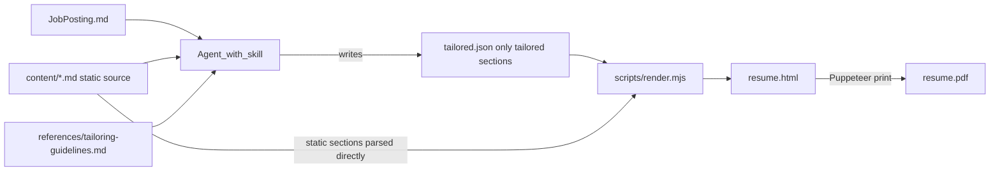

---
todos:
  - id: scaffold-repo
    status: completed
    content: 'Scaffold repo: package.json (node >=20, puppeteer), .gitignore, README with authoring and usage docs'
  - id: content-format
    status: completed
    content: Define content/*.md conventions and write placeholder example content for all six sections
  - id: template-css
    status: completed
    content: 'Build template.html and resume.css: single-column, one-page, ATS-friendly layout with print CSS'
  - id: render-script
    status: completed
    content: 'Implement scripts/render.mjs: parse static MD, validate tailored.json (with factual anchor checks), token-fill HTML, Puppeteer PDF, one-page warning'
  - id: skill-md
    status: completed
    content: Write SKILL.md (frontmatter + workflow instructions) plus references/tailoring-guidelines.md and references/payload-format.md
  - id: example-job
    status: completed
    content: 'Add jobs/example-job with sample posting and valid tailored.json; wire npm run render:example as smoke test and verify PDF output'
name: Resume Tailor Skill
overview: 'Build a new repo (Maximebb/resume-tailor) containing an Agent Skill: the LLM reads your static Markdown content plus a job posting, writes tailored section text, and runs a deterministic Node script that renders an eye-pleasing HTML template to PDF.'
isProject: false
---
# Resume Tailor — Agent Skill + HTML/PDF Renderer

**Prerequisite (manual, one-time):** create the empty GitHub repo `Maximebb/resume-tailor` and relaunch a cloud agent from it with this plan. This plan is written to be executed in that fresh workspace.

## Architecture

The division of labor is the core design: the **LLM (via the skill) does all tailoring**, the **script does all rendering**. The script never calls an LLM; the LLM never hand-writes HTML.



Integrity guarantee: the render script reads **static sections (contact, education, certifications) directly from `content/*.md`** — the LLM cannot alter them. The LLM's JSON payload supplies only the tailorable sections (summary/about, experience bullets, skills), and the script cross-checks factual anchors (company names, titles, dates) against `content/experience.md`, refusing to render if the payload invents an employer or changes dates.

## Repo layout (repo root = skill directory)

```
resume-tailor/
  SKILL.md                      # skill entry point (name matches repo dir)
  content/                      # user-authored source of truth (Markdown)
    contact.md                  # name, email, phone, links (key: value lines)
    about.md                    # full "master" about-me text
    experience.md               # ## Company — Title, dates line, master bullets
    skills.md                   # full skill inventory, grouped
    education.md
    certifications.md
  references/
    tailoring-guidelines.md     # resume-writing + tailoring rules (loaded on demand)
    payload-format.md           # documented JSON schema with an example
  scripts/
    render.mjs                  # tailored.json + content/*.md -> HTML -> PDF
    template.html               # single-page HTML template with {{tokens}}
    resume.css                  # screen + print stylesheet
  jobs/                         # one folder per posting: posting + payload + output
    example-job/                # checked-in worked example (posting, payload, output)
  package.json                  # node >=20, puppeteer as the only real dependency
  README.md
```

## The skill (`SKILL.md`)

- Frontmatter: `name: resume-tailor` (must match directory name), `description` covering what it does and triggers ("tailor my resume to this job posting", "generate a resume for this role").
- Body (<500 lines) instructs the agent to:
  1. Read the job posting the user provides, and all of `content/*.md`.
  2. Read `references/tailoring-guidelines.md` before writing anything.
  3. Produce `jobs/<job-slug>/tailored.json` per `references/payload-format.md`: rewritten about/summary, per-role experience bullets (reworded and re-prioritized, facts unchanged), and a selected/reordered skills list mirroring the posting's terminology.
  4. Run `node scripts/render.mjs jobs/<job-slug>/tailored.json` and fix any validation errors it reports.
  5. Report back: which keywords from the posting were mirrored, what was emphasized or dropped, and a one-page-fit confirmation.
- Hard rules stated in the skill: never fabricate employers, titles, dates, credentials, or metrics; never edit `content/`; only select, reorder, and reword.

## Tailoring guidelines (`references/tailoring-guidelines.md`)

Encodes resume design/writing principles the LLM must follow: lead bullets with strong action verbs, quantify where the source content has numbers, mirror the posting's exact terminology where truthful (ATS keyword matching), most relevant experience/bullets first, target one page, no first-person pronouns in bullets, consistent tense (past roles past-tense, current role present-tense).

## Render script (`scripts/render.mjs`)

- Parses static sections from `content/contact.md`, `education.md`, `certifications.md` using simple documented conventions (key: value lines and `##` headings).
- Validates `tailored.json` (hand-rolled checks, no heavy schema lib): required fields, bullet counts, and factual anchors matching `content/experience.md`. Prints actionable error messages the agent can fix.
- Fills `template.html` by token replacement (with HTML-escaping), writes `resume.html` next to the payload, then launches Puppeteer to print `resume.pdf` (Letter, ~0.6in margins, `printBackground: true`).
- Warns loudly if output exceeds one page (checked via the rendered body height), so the agent knows to trim bullets and rerun.

## HTML template design

Single-column, ATS-friendly layout: name + contact header, then Summary, Experience, Skills, Education, Certifications. Clear typographic hierarchy (name > section headings > role lines > body), one accent color, system-font stack with a print-safe fallback, generous whitespace, hairline section rules, no images or icons for text content. Print CSS uses `@page` margins and `break-inside: avoid` on entries so browser "Save as PDF" matches the Puppeteer output.

## Bootstrapping and verification

- Ship placeholder example content in `content/` (clearly marked fictional) so the repo works immediately; the user replaces it with their real content.
- Check in `jobs/example-job/` with a sample posting and a valid `tailored.json`; `npm run render:example` serves as the smoke test proving the JSON-to-PDF path end to end.
- README documents: install (`npm install`), authoring your `content/` files, and the workflow ("open the repo in Cursor/Claude Code, paste or point to a job posting, ask it to tailor your resume").
